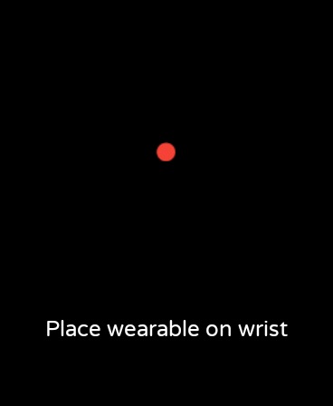
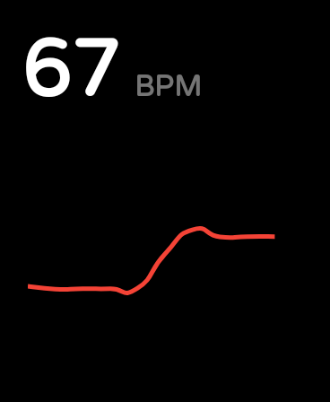

# Simple HRM

A demo Android application for wearable devices that reads and displays heart rate data.

Simple HRM determines if the wearable is being worn using the [TYPE_LOW_LATENCY_OFFBODY_DETECT](https://developer.android.com/reference/android/hardware/Sensor#TYPE_LOW_LATENCY_OFFBODY_DETECT) sensor and reads heart rate data (as beats per minute) using the [TYPE_HEART_RATE](https://developer.android.com/reference/android/hardware/Sensor#TYPE_HEART_RATE) sensor.





## Setup

After installing, grant permissions using ADB:

```
adb shell pm grant com.trevorhalvorson.simplehrm android.permission.BODY_SENSORS
```

## UI

-   Design: https://dribbble.com/shots/14454424-Activity-Watch-App-Shot
-   Chart: https://github.com/PhilJay/MPAndroidChart
-   Loading animation: https://lottiefiles.com/8771-loading
-   Font: https://fonts.google.com/specimen/Varela+Round
