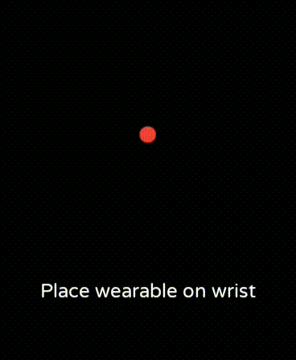

# Simple HRM

A demo Android application for wearable devices that reads and displays heart rate data.

The latest APK version can be downloaded from the [Releases page](https://github.com/trevorhalvorson/simple-hrm/releases/latest).

## How It Works

Simple HRM determines if the wearable is being worn using the [TYPE_LOW_LATENCY_OFFBODY_DETECT](https://developer.android.com/reference/android/hardware/Sensor#TYPE_LOW_LATENCY_OFFBODY_DETECT) sensor and then reads heart rate data (as beats per minute) using the [TYPE_HEART_RATE](https://developer.android.com/reference/android/hardware/Sensor#TYPE_HEART_RATE) sensor.

If the `TYPE_LOW_LATENCY_OFFBODY_DETECT` sensor sends an event that the device is off-body the UI will alert the user to place the device on their wrist.
When the `TYPE_LOW_LATENCY_OFFBODY_DETECT` sensor sends an event that the device is on-body the UI will alert the user that their heart rate is being read.
Then, once the `TYPE_HEART_RATE` sensor sends an event with a value for heart rate the UI will display the latest heart rate in beats per minute (BPM) and also display the 10 latest HR values in a line chart.

## Design

-   UI: https://dribbble.com/shots/14454424-Activity-Watch-App-Shot
-   Chart: https://github.com/PhilJay/MPAndroidChart
-   Loading animation: https://lottiefiles.com/8771-loading
-   Font: https://fonts.google.com/specimen/Varela+Round
